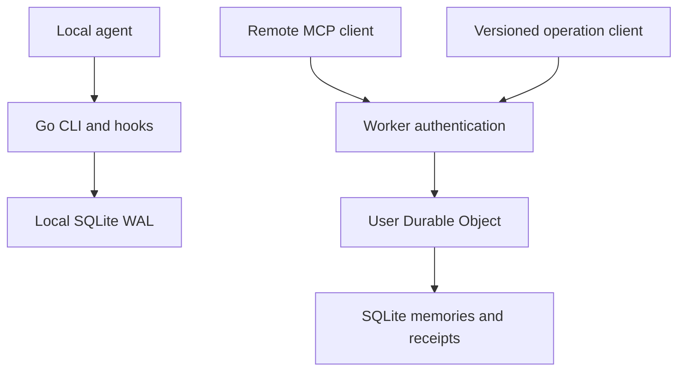

# Optional Cloudflare memory service

## Architecture

The local product remains a Go binary with SQLite WAL, filesystem profiling and host hooks. The service boundary is `MemoryBackend`; `Service.Call` uses an injected backend when supplied and defaults to the local `Store`. Diagnostics, hooks, backup and the local dashboard keep their local storage APIs. No network adapter is selected automatically.

The hosted pilot is a separate TypeScript package in `cloudflare/`:



The Worker verifies issuer, audience, signature, expiry, token age, subject allowlist and scopes. It derives the object name from the configured tenant and verified subject. No client-supplied ownership fields are accepted. Browser origins and the endpoint origin must match configuration.

`createMcpHandler` supplies stateless MCP transport; the Durable Object owns persistent application memory. A new MCP connection resolves to the same application object. The deprecated session-based `McpAgent` path is not used.

The version 1 operation envelope is `{version, tool, arguments}`. Mutating tool arguments include a stable `operation_id`. A synchronous SQLite transaction commits the memory change, indexes and response receipt together. The receipt holds the normalized request and original response, so interrupted callers can retry without repeating the change. An ID reused with different arguments fails explicitly.

Private project and conversation scopes are inside the owning user's object. Reviewed team snapshots use a separate tenant/team object with server-configured membership and independent review authority. Imports remain local drafts until approved. Evidence reads use a separate tenant/user object and explicit source authorization. Do not reinterpret matching project labels as permission to share.

## Authenticated request rate limiting

The `RATE_LIMITER` Workers Rate Limiting binding is checked after JWT verification and the subject allowlist, **before reading the request body or accessing any Durable Object**. Its key is the server-configured `TENANT_ID` followed by `:` and the verified JWT `sub`. Tokens, client headers and request arguments cannot choose another subject's key. All authenticated requests to `/mcp`, `/v1/operations`, `/v1/sync`, `/v1/team` and `/v1/evidence` share that subject's allowance, including retries and malformed requests. This is a request limit, not a tool-call or daily spending quota; an MCP request can contain more than one operation.

`cloudflare/wrangler.jsonc` defaults to 60 requests per 60 seconds per key:

```jsonc
"ratelimits": [{
  "name": "RATE_LIMITER",
  "namespace_id": "1001", // Example only; choose an unused numeric namespace in your account.
  "simple": { "limit": 60, "period": 60 }
}]
```

Before deployment, replace the example namespace ID with an operator-chosen numeric ID, unique to this limiter in your account (not an account or zone ID). Keep it stable across deployments to retain the same limiter namespace; use separate namespaces for independent environments. Tune `simple.limit` and `simple.period` against observed traffic, CPU, Durable Object rows and outbound evidence costs. Supported periods are 10 or 60 seconds. Cloudflare rate limiting is permissive, location-local and eventually consistent, **not a precise global counter or protection against exhausting account quotas**. Evidence requests use the same limiter; this PR does not add a separate evidence allowance.

A rejected request returns HTTP 429, JSON `{"error":"Authenticated request rate limit exceeded"}`, `Cache-Control: no-store` and `Retry-After: 60`. The binding does not expose an exact reset time, so 60 seconds is a conservative delay for either supported period, not a guarantee the next request succeeds. Clients should back off with jitter, honor the header and preserve write `operation_id` / evidence `request_id` values on retry.

A missing binding fails closed with HTTP 503 before body processing or storage access. A binding error also fails closed with 503. For local development **only**, explicitly set `RATE_LIMIT_DISABLED="true"` in local environment variables when the binding is absent; other spellings do not bypass the check. The flag never bypasses a present binding. Do not set it in production. The tests inject a deterministic allow stub, then replace it per request to test denial and missing-binding behavior; they do not claim to verify Cloudflare's distributed enforcement. `/health` and OAuth protected-resource metadata remain public and do not require the binding.

### Edge protection for unauthenticated traffic

JWT verification still costs Worker CPU, and unauthenticated traffic has no trusted subject key. Configure a Cloudflare WAF rate-limiting rule on a custom-domain route **before production exposure**, counting all requests by source IP to the protected paths (including requests with bogus Authorization headers). For example, use this matching expression, replacing the hostname:

```text
(http.host eq "memory.example.com" and http.request.uri.path in {"/mcp" "/v1/operations" "/v1/sync" "/v1/team" "/v1/evidence"})
```

Choose an IP threshold and mitigation duration for your plan and expected shared-IP clients (a small pilot might start at 120 requests per IP per minute, blocking for 60 seconds, where the plan supports it). Counting only requests missing Authorization would let forged headers bypass edge protection. Also protect public discovery/health routes with suitable edge rules if abused. Rule availability, periods and counting characteristics depend on the Cloudflare plan; verify support rather than assuming Workers Free includes a particular WAF feature. If you cannot configure equivalent edge protection, restrict exposure and do not treat the subject limiter as an unauthenticated-traffic defense. WAF rules on a zone do not protect a separate `workers.dev` hostname: pin `PUBLIC_ORIGIN` to the protected custom domain and disable `workers_dev` in production, or separately protect every exposed route.

Rate Limiting API source: https://developers.cloudflare.com/workers/runtime-apis/bindings/rate-limit/

## Lifetime caps and operator recovery

These application storage caps are **lifetime totals**, independent of the short request-limit window and Cloudflare's daily quotas. They do not reset at midnight or on redeploy/restart. Current limits and behavior:

| Object | Lifetime cap | What still works at the cap |
| --- | --- | --- |
| Personal tenant/subject | 1,000 stored memories (including retired); 10,000 ordinary mutation receipts shared by operations and sync | Reads, sync pulls and exact receipt replays remain available. At the memory cap, feedback/updates can continue if receipts remain; no new memories can be stored. At the receipt cap, new ordinary mutations fail; active-memory retirements have a reserve up to 11,000 total receipts. |
| Tenant/team | 1,000 proposals (including retired); 10,000 ordinary propose/review receipts | Pulls and exact replays remain available. At the proposal cap, reviews can continue if receipts remain. Active-proposal retirement has a reserve up to 11,000 total receipts. |
| Evidence tenant/subject | 1,000 evidence receipts | Existing `request_id` replays return provenance only, without another external fetch; new reads fail. |

Cap failures on the versioned HTTP routes return 422 (evidence returns the generic evidence-read failure); MCP tools report an error result. The object is not completely unreadable at a cap, but capacity does not recover by waiting. `forget_memory`, sync tombstones and team retirement remove items from active recall/sharing, **not from storage or lifetime counters**. Users cannot free capacity through retirement. Exact retries do not consume another receipt; new operation IDs can. The withdrawal reserve permits only active-item retirement after ordinary receipts are exhausted, not repeated retirements under new IDs. No configurable runtime cap increase, receipt-pruning API, reset endpoint or physical-deletion API exists in this release.

For an exhausted pilot object, an operator can move forward using the existing identity/configuration boundaries, not an in-place reset:

1. Pause new writes/reads that would allocate receipts. Keep the old identity available only as needed for authorized export and outstanding retries. Export needed personal data via the existing sync pull workflow and retain local backups before changing access; evidence receipts contain provenance, not the external content. Retire any team snapshots that should no longer be shared separately—personal retirement does not withdraw team copies.
2. For personal/evidence capacity, provision a **new verified OAuth subject** for the user in the issuer and replace the old entry in `AUTH_SUBJECTS` when export/retries are complete. Object names are `[TENANT_ID, sub]`; there is no subject-alias/user-mapping setting. Issue a token for the new subject and update any `TEAM_MEMBERS` member/reviewer entries and `EVIDENCE_CONNECTORS` user allowlists / `EVIDENCE_CREDENTIALS` subject keys. Check access and scopes before resuming. Rotating a token with the same `sub` does not create new capacity.
3. For an exhausted team object, provision a **new team name** in `TEAM_MEMBERS` and update clients to use it. Rotating an author's subject alone does not reset a team object, which is keyed by `[TENANT_ID, team]`. Re-propose only selected active memories and require independent review again; old reviews do not transfer.
4. Start with an empty object or selectively sync reviewed, active personal memories into the new subject (new-object `expected_revision: 0`, fresh operation IDs). Reset client sync cursors and reconcile local revision state for the new account/team before pushing. Preserve backups and do not blindly import 1,000 entries, retired rows, receipts or old authority. A full import to the old cap immediately consumes the new capacity. Memories, feedback, receipts, evidence history and team approval are not automatically migrated.
5. Verify the new identity's isolation and successful operations, then remove old access/configuration entries as appropriate. The old Durable Object and its data still exist; this workaround is not deletion or a reset of the old object. Changing `TENANT_ID` would affect every subject and team in that tenant, so it is not a per-user recovery mechanism.

**Follow-up:** design an authorized, audited retention/reset workflow with export, physical deletion, receipt expiry and an explicit idempotency/retry horizon. Until that exists, use conservative pilot traffic and monitor growth; raising hardcoded caps requires a separately reviewed code change and capacity measurements, not an undocumented config knob.

## Free-tier budget

Checked against Cloudflare documentation on 2026-10-04. These are account-level allocations, shared with other usage.

| Meter | Workers Free allocation |
| --- | --- |
| Worker requests | 100,000 per day |
| Worker CPU | 10 ms per invocation |
| Durable Object requests | 100,000 per day |
| Durable Object duration | 13,000 GB-s per day |
| Durable Object SQLite rows read | 5 million per day |
| Durable Object SQLite rows written | 100,000 per day |
| Durable Object SQLite stored data | 5 GB across the account |
| Individual SQLite Durable Object | 1 GB |

Only SQLite-backed Durable Objects are available on Free. Exceeding a free quota causes further operations of that type to fail. Daily quotas reset at 00:00 UTC. The Worker and Durable Object request quotas are separate meters; one external operation may consume both.

For an illustrative five-person pilot with 100 operations each per day, 500 operations is 0.5% of the Worker request allowance before MCP discovery, retries and other account traffic. This is a planning example, not measured capacity. Each lesson inserts its distinct lexical terms into an index, so writes include the memory, receipt, token rows and index maintenance. SQL rows read include query work, not just returned hits. Measure these meters rather than multiplying result count by calls.

The pilot uses no model calls, embeddings, always-open sockets or scheduled polling. It has bounded bodies, task terms, per-memory tokens, retrieval candidates, memory counts and receipt counts. These controls limit work but do not prove execution fits 10 ms on Cloudflare hardware. Benchmark the deployed MCP discovery and tool paths; inspect p95/p99 CPU and row costs before raising limits or adding features. Local timing and the Workers test runtime do not enforce the production plan's CPU quota.

An existing OAuth issuer is required for interactive production login. Its plan and any costs are independent of Cloudflare. Local development uses a generated, one-hour signed token. No paid auth service is required to run the local tests.

Pricing sources:

- https://developers.cloudflare.com/workers/platform/pricing/
- https://developers.cloudflare.com/durable-objects/platform/pricing/
- https://developers.cloudflare.com/durable-objects/platform/limits/

## Acceptance and rollout

Local tests verify access control, malformed inputs, scope and condition checks, bounded context, retry receipts, interrupted transactions, feedback deduplication, retirement, fresh MCP connections and forced object restart. Both Go and TypeScript execute a shared recall fixture. This checks core guarantees on small corpora; it does not establish full implementation equivalence, retrieval quality or productivity gains.

Rollout order:

1. Review and merge the backend boundary and hosted pilot after CI passes.
2. Configure a Workers Free account, a dedicated issuer/audience and a small subject allowlist. Deploy explicitly and exercise real MCP clients.
3. Measure CPU, quota consumption, cold starts, persistence and failures on the deployed service.
4. Exercise the opt-in [sync and team workflows](cloud-sync.md) after reviewing their dependent PR. Keep private local memories local unless syncing was selected.
5. Configure independent review authority and team membership. Retention and physical deletion remain future work.
6. Review and configure the optional [outbound MCP evidence connectors](mcp-evidence.md) after the hosted memory lifecycle is stable.

Deployment is not part of the package build. There is no automatic upload, account upgrade, model call or publishing from CI.

Validation recorded on 2026-10-04:

- Go 1.25.8: `go test -race ./...`, `go vet ./...`, binary build, self-test, CLI/MCP acceptance and automatic-hook acceptance passed. The hook acceptance is a synthetic harness, not a native agent/model session.
- Node 24.19.0: TypeScript checks, 30 local Workers-runtime tests and the Wrangler dry-run build passed. The compressed Worker bundle was 373.69 KiB. CI targets Node 22 separately.
- The local token generator ran successfully. Standalone `wrangler dev` could not start in this execution workspace because network-interface inspection failed with `uv_interface_addresses`. No standalone socket test or Cloudflare deployment is claimed. The hosted integration tests exercised the actual Workers runtime through its test runner.

SDK sources:

- https://developers.cloudflare.com/agents/model-context-protocol/apis/handler-api/
- https://developers.cloudflare.com/agents/model-context-protocol/guides/migrate-to-mcp-sdk-v2/
- https://developers.cloudflare.com/agents/model-context-protocol/apis/client-api/
