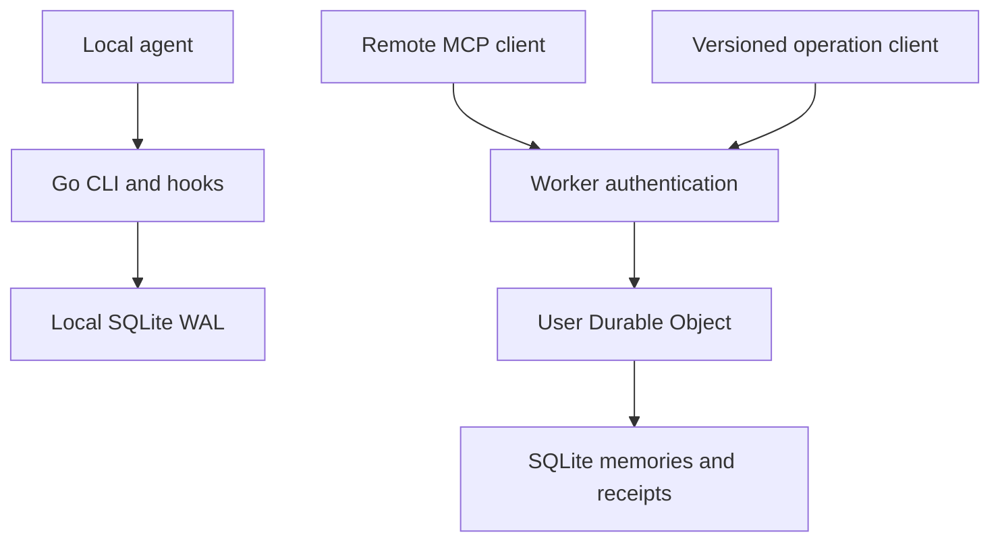

# Optional Cloudflare memory service

## Architecture

The local product remains a Go binary with SQLite WAL, filesystem profiling and host hooks. The service boundary is `MemoryBackend`; `Service.Call` uses an injected backend when supplied and defaults to the local `Store`. Diagnostics, hooks, backup and the local dashboard keep their local storage APIs. No network adapter is selected automatically.

The hosted pilot is a separate TypeScript package in `cloudflare/`:

The Worker verifies issuer, audience, signature, expiry, token age, subject allowlist and scopes. It derives the object name from the configured tenant and verified subject. No client-supplied ownership fields are accepted. Browser origins and the endpoint origin must match configuration.

`createMcpHandler` supplies stateless MCP transport; the Durable Object owns persistent application memory. A new MCP connection resolves to the same application object. The deprecated session-based `McpAgent` path is not used.

The version 1 operation envelope is `{version, tool, arguments}`. Mutating tool arguments include a stable `operation_id`. A synchronous SQLite transaction commits the memory change, indexes and response receipt together. The receipt holds the normalized request and original response, so interrupted callers can retry without repeating the change. An ID reused with different arguments fails explicitly.

Private project and conversation scopes are inside the owning user's object. Shared project/team objects require a separate membership and review boundary before they can be enabled. Do not reinterpret matching project labels as permission to share.

## Free-tier budget

Checked against Cloudflare documentation on 2026-10-04. These are account-level allocations, shared with other usage.

| Meter | Workers Free allocation |
| --- | --- |
| Worker requests | 100,000 per day |
| Worker CPU | 10 ms per invocation |
| Durable Object requests | 100,000 per day |
| Durable Object duration | 13,000 GB-s per day |
| Durable Object SQLite rows read | 5 million per day |
| Durable Object SQLite rows written | 100,000 per day |
| Durable Object SQLite stored data | 5 GB across the account |
| Individual SQLite Durable Object | 1 GB |

Only SQLite-backed Durable Objects are available on Free. Exceeding a free quota causes further operations of that type to fail. Daily quotas reset at 00:00 UTC. The Worker and Durable Object request quotas are separate meters; one external operation may consume both.

For an illustrative five-person pilot with 100 operations each per day, 500 operations is 0.5% of the Worker request allowance before MCP discovery, retries and other account traffic. This is a planning example, not measured capacity. Each lesson inserts its distinct lexical terms into an index, so writes include the memory, receipt, token rows and index maintenance. SQL rows read include query work, not just returned hits. Measure these meters rather than multiplying result count by calls.

The pilot uses no model calls, embeddings, always-open sockets or scheduled polling. It has bounded bodies, task terms, per-memory tokens, retrieval candidates, memory counts and receipt counts. These controls limit work but do not prove execution fits 10 ms on Cloudflare hardware. Benchmark the deployed MCP discovery and tool paths; inspect p95/p99 CPU and row costs before raising limits or adding features. Local timing and the Workers test runtime do not enforce the production plan's CPU quota.

An existing OAuth issuer is required for interactive production login. Its plan and any costs are independent of Cloudflare. Local development uses a generated, one-hour signed token. No paid auth service is required to run the local tests.

Pricing sources:

- https://developers.cloudflare.com/workers/platform/pricing/
- https://developers.cloudflare.com/durable-objects/platform/pricing/
- https://developers.cloudflare.com/durable-objects/platform/limits/

## Acceptance and rollout

Local tests verify access control, malformed inputs, scope and condition checks, bounded context, retry receipts, interrupted transactions, feedback deduplication, retirement, fresh MCP connections and forced object restart. Both Go and TypeScript execute a shared recall fixture. This checks core guarantees on small corpora; it does not establish full implementation equivalence, retrieval quality or productivity gains.

Rollout order:

1. Review and merge the backend boundary and hosted pilot after CI passes.
2. Configure a Workers Free account, a dedicated issuer/audience and a small subject allowlist. Deploy explicitly and exercise real MCP clients.
3. Measure CPU, quota consumption, cold starts, persistence and failures on the deployed service.
4. Add opt-in local sync using an outbox, stable operations and explicit scope selection. Keep private local memories local unless syncing was selected.
5. Add reviewed team promotion and server-enforced membership, revision conflicts, retention and physical deletion.
6. Add Agents SDK outbound MCP clients for explicitly authorized evidence sources after the hosted memory lifecycle is stable.

Deployment is not part of the package build. There is no automatic upload, account upgrade, model call or publishing from CI.

Validation recorded on 2026-10-04:

- Go 1.25.8: `go test -race ./...`, `go vet ./...`, binary build, self-test, CLI/MCP acceptance and automatic-hook acceptance passed. The hook acceptance is a synthetic harness, not a native agent/model session.
- Node 24.19.0: TypeScript checks, 19 local Workers-runtime tests and the Wrangler dry-run build passed. The compressed Worker bundle was 222.58 KiB. CI targets Node 22 separately.
- The local token generator ran successfully. Standalone `wrangler dev` could not start in this execution workspace because network-interface inspection failed with `uv_interface_addresses`. No standalone socket test or Cloudflare deployment is claimed. The hosted integration tests exercised the actual Workers runtime through its test runner.

SDK sources:

- https://developers.cloudflare.com/agents/model-context-protocol/apis/handler-api/
- https://developers.cloudflare.com/agents/model-context-protocol/guides/migrate-to-mcp-sdk-v2/
- https://developers.cloudflare.com/agents/model-context-protocol/apis/client-api/
